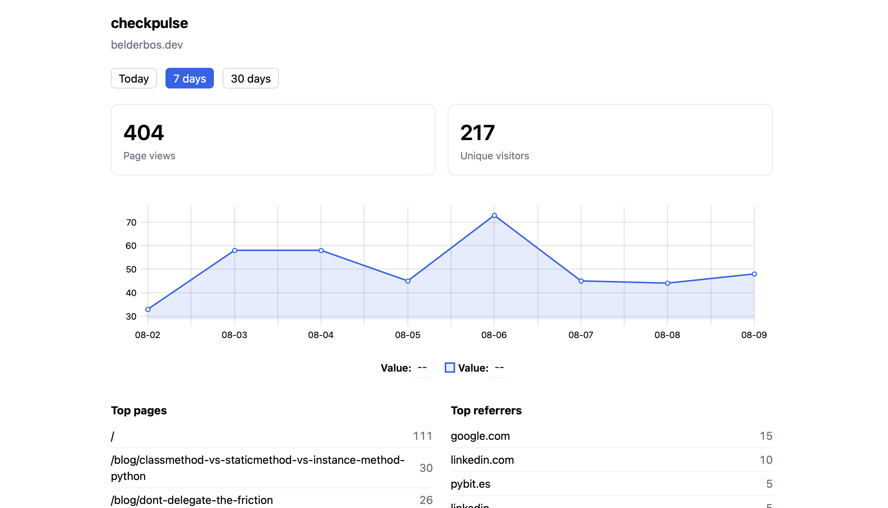

# checkpulse

Self-hosted, privacy-first web analytics in a single Rust binary. No cookies, no stored IPs, no consent banner. One SQLite file holds everything, and it runs on a Fly.io machine that sleeps when nobody's looking — a few cents a month for a personal site.

<!-- Add a dashboard screenshot at docs/dashboard.png, then uncomment:

-->

```html
<script src="https://your-app.fly.dev/script.js"></script>
```

That one tag is the whole integration. It works on any site — Zola, Hugo, Astro, Next.js, plain HTML — and it handles SPA route changes on its own.

## Why this instead of…

| | checkpulse | Plausible Cloud | GA4 |
|---|---|---|---|
| Cost | Your Fly bill (cents/month) | From $9/month | Free |
| Where the data lives | Your SQLite file | Their servers | Google |
| Cookie/consent banner | Not needed | Not needed | Usually required |
| Script size | ~700 bytes | ~1 KB | ~50 KB |
| Setup | `fly deploy` | Sign up | Tag manager, property config |
| Hackable | ~1,000 lines of Rust you own | No | No |

It exists because a personal site doesn't need session recording and a funnel builder — it needs to know which posts people read and where they came from. That fits in a binary you can read end to end in an afternoon.

## What you get

A dashboard at `/` (basic auth, `?period=today|7d|30d`) showing:

- Page views and approximate unique visitors
- A views-over-time chart
- Top pages, top referrers, top custom events
- Browser family (Chrome/Safari/Firefox/Edge/Other) and device type (desktop/mobile)

Three endpoints on one binary: `/script.js` (the tracker), `/api/event` (ingestion), `/` (the dashboard). Plus `/health`.

**What you don't get:** one deployment tracks one site. No funnels, goals, retention policies, scheduled email reports, or multi-user logins. If you need those, use Plausible.

## Deploy your own

You need a [Fly.io](https://fly.io) account and `flyctl`.

```bash
git clone https://github.com/bbelderbos/checkpulse.git
cd checkpulse

fly launch --no-deploy            # pick your own app name and region
fly volumes create checkpulse_data --region <your-region> --size 1
fly secrets set DASHBOARD_USER=admin DASHBOARD_PASSWORD='<a long random password>'
fly deploy
```

Then point `fly.toml` at your own site — these are the only values you must change:

```toml
[env]
  DATABASE_PATH = "/data/checkpulse.db"
  SITE_ID = "example.com"                # your domain
  ALLOWED_ORIGIN = "https://example.com" # rejects events from anywhere else
```

Redeploy, then add the script tag to your site's `<head>`:

```html
<script src="https://your-app.fly.dev/script.js"></script>
```

Visit `https://your-app.fly.dev/` and log in with the credentials you set. Views should appear within seconds.

### What it costs

With `auto_stop_machines = "suspend"` and `min_machines_running = 0` (already in `fly.toml`), the machine suspends when idle and wakes on the next request. A `shared-cpu-1x` 256 MB machine running full time is about $2/month, and the 1 GB volume is $0.15/month — a low-traffic site lands well under that. Check [current Fly pricing](https://fly.io/docs/about/pricing/) before you trust any number in a README.

Nothing here is Fly-specific, though. It's a Dockerfile and a volume: any host that runs a container with persistent disk works.

## Run locally

```bash
cp .env.example .env    # set DASHBOARD_PASSWORD
DASHBOARD_USER=admin DASHBOARD_PASSWORD=secret PORT=8099 cargo run
```

The dashboard is at http://localhost:8099/. The tracking snippet deliberately ignores `localhost`, so send a test event by hand:

```bash
curl -X POST localhost:8099/api/event \
  -H 'User-Agent: Mozilla/5.0' \
  -d '{"path":"/hello","referrer":"https://news.ycombinator.com/"}'
```

(`ALLOWED_ORIGIN` defaults to a real domain, so set it empty locally if you want to post without matching headers.)

## Config

| Var | Default | Notes |
|-----|---------|-------|
| `DATABASE_PATH` | `checkpulse.db` | SQLite file path |
| `SITE_ID` | `belderbos.dev` | Tag stored on every event; also used to drop self-referrals |
| `ALLOWED_ORIGIN` | `https://belderbos.dev` | Events whose `Origin`/`Referer` doesn't match are rejected (empty = disabled) |
| `DASHBOARD_USER` | `admin` | Dashboard basic auth username |
| `DASHBOARD_PASSWORD` | _(required)_ | The app refuses to start if unset |
| `BIND` / `PORT` | `0.0.0.0` / `8080` | Listen address |

## Custom events

The snippet exposes `window.checkpulse(name)` for things that aren't page loads:

```html
<button onclick="checkpulse('newsletter-signup')">Subscribe</button>
<a href="https://github.com/bbelderbos" onclick="checkpulse('outbound-github')">GitHub</a>
```

Each call stores the event name and the current path — nothing else. Names are capped at 64 characters and stored verbatim, so keep personal data out of them. They show up in the dashboard's **Top events** panel, counted separately from page views.

Because every event row keeps the path it fired from, you can break any event down by article without tracking anything extra. See [OPERATIONS.md](OPERATIONS.md#querying-custom-events) for the `just events` queries.

## Privacy model

No cookies, no `localStorage`, no stored IPs.

The visitor's IP feeds a daily-salted SHA-256 hash used for approximate unique counting, then is discarded. The salt is random, in-memory, and rotates every 24 hours and on restart — so visitors can't be correlated across days, and there's nothing on disk to recover them from. `DNT: 1` requests are dropped before anything is recorded. Browser family and device type are coarse enough (five buckets, two buckets) to be useless for fingerprinting.

This is the Plausible model: privacy-respecting *aggregate* analytics. In most jurisdictions that means no consent banner, but this is not legal advice.

## Security

Properties verified by review:

- **No SQL injection** — every query uses bound parameters (sqlx prepared statements); request data is never concatenated into SQL.
- **No stored XSS** — dashboard output is auto-escaped (Askama); the only unescaped values are server-generated chart numbers and dates.
- **No PII at rest** — see the privacy model above.
- **Authenticated dashboard** — basic auth over forced HTTPS; the app refuses to start without `DASHBOARD_PASSWORD`. Use a long random one: the dashboard is not rate-limited.
- **Abuse limits** — per-IP rate limiting (120 req/min) on `/api/event`, `Origin`/`Referer` allow-listing, a 4 KB request-body cap, and field-length caps on path, referrer, and event name.
- **Bot filtering** — requests without a browser-shaped User-Agent, and known crawler tokens, are dropped.
- **Hardened runtime** — runs as a non-root user in the container; secrets come from env / Fly secrets and are gitignored locally.

## Develop

```bash
cargo fmt
cargo clippy --all-targets -- -D warnings
cargo test
just cov          # coverage summary
```

Day-to-day operation of a deployed instance — logs, backups, password rotation, querying events, teardown — lives in [OPERATIONS.md](OPERATIONS.md).

## License

MIT
